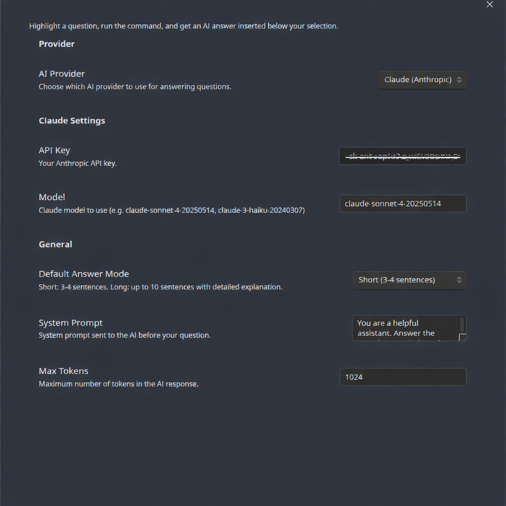

# Answer with AI

An [Obsidian](https://obsidian.md) plugin that lets you highlight a question in your notes and get an AI-generated answer inserted right below it.

## Features

- **Multi-provider support** — Choose between **Claude (Anthropic)**, **OpenAI (GPT)**, or **Google Gemini** as your AI provider.
- **Short & Long answer modes** — Get a quick 3-4 sentence summary or a detailed explanation of up to 10 sentences.
- **Customizable system prompt** — Fine-tune how the AI responds by editing the system prompt in settings.
- **Plain text output** — Answers are inserted as clean, plain text without markdown formatting.

## How It Works

1. Highlight a question in your note.
2. Open the Command Palette (`Ctrl+P` / `Cmd+P`).
3. Choose one of:
   - **Answer selected question with AI (Short)** — concise, 3-4 sentence answer.
   - **Answer selected question with AI (Long)** — detailed, up to 10 sentence explanation.
4. The answer is inserted directly below your selection.

## Settings

| Setting | Description |
|---|---|
| **AI Provider** | Select Claude, OpenAI, or Gemini. |
| **API Key** | Your API key for the selected provider. |
| **Model** | The model to use (e.g. `claude-sonnet-4-20250514`, `gpt-4o`, `gemini-2.0-flash`). |
| **Default Answer Mode** | Choose between Short (3-4 sentences) and Long (up to 10 sentences) as the default. |
| **System Prompt** | The base system prompt sent to the AI before your question. |
| **Max Tokens** | Maximum number of tokens in the AI response. |

## Installation

### Manual Installation

1. Download `main.js`, `manifest.json`, and `styles.css` from the [latest release](../../releases/latest).
2. Create a folder called `answer-with-ai` inside your vault's `.obsidian/plugins/` directory.
3. Place the downloaded files into that folder.
4. Open Obsidian Settings > Community Plugins > Enable "Answer with AI".
5. Configure your API key and preferred provider in the plugin settings.

## Configuration

1. Go to **Settings > Answer with AI**.
2. Select your preferred AI provider.
3. Enter your API key for the selected provider.
4. Optionally adjust the model, answer mode, system prompt, and max tokens.

## Supported Providers

| Provider | API Key Required | Example Models |
|---|---|---|
| **Claude (Anthropic)** | `sk-ant-...` | `claude-sonnet-4-20250514`, `claude-3-haiku-20240307` |
| **OpenAI** | `sk-proj-...` | `gpt-4o`, `gpt-4o-mini`, `gpt-3.5-turbo` |
| **Gemini (Google)** | Google AI API key | `gemini-2.0-flash`, `gemini-1.5-pro` |

## License

MIT
